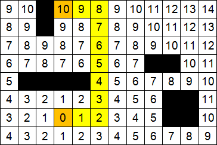
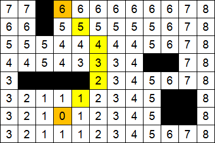

***Алгори́тм волново́й трассиро́вки*** (волновой алгоритм, алгоритм Ли) — алгоритм поиска пути, алгоритм поиска кратчайшего пути на планарном графе. Принадлежит к алгоритмам, основанным на методах поиска в ширину.

В основном используется при компьютерной трассировке (разводке) печатных плат, соединительных проводников на поверхности микросхем. Другое применение волнового алгоритма — поиск кратчайшего расстояния на карте в компьютерных стратегических играх.

Волновой алгоритм в контексте поиска пути в лабиринте был предложен Э. Ф. Муром. Ли независимо открыл этот же алгоритм при формализации алгоритмов трассировки печатных плат в 1961 году.

***Описание алгоритма***
Алгоритм работает на дискретном рабочем поле (ДРП), представляющем собой ограниченную замкнутой линией фигуру, не обязательно прямоугольную, разбитую на прямоугольные ячейки, в частном случае — квадратные. Множество всех ячеек ДРП разбивается на подмножества: «проходимые» (свободные), т. е при поиске пути их можно проходить, «непроходимые» (препятствия), путь через эту ячейку запрещён, стартовая ячейка (источник) и финишная (приемник). Назначение стартовой и финишной ячеек условно, достаточно — указание пары ячеек, между которыми нужно найти кратчайший путь.

Алгоритм предназначен для поиска кратчайшего пути от стартовой ячейки к конечной ячейке, если это возможно, либо, при отсутствии пути, выдать сообщение о непроходимости.

Работа алгоритма включает в себя три этапа: **инициализацию, распространение волны и восстановление пути**.

Во время инициализации строится образ множества ячеек обрабатываемого поля, каждой ячейке приписываются атрибуты проходимости/непроходимости, запоминаются стартовая и финишная ячейки.

Далее, от стартовой ячейки порождается шаг в соседнюю ячейку, при этом проверяется, проходима ли она, и не принадлежит ли ранее меченной в пути ячейке.

Соседние ячейки принято классифицировать двояко: в смысле окрестности Мура и окрестности фон Неймана, отличающийся тем, что в окрестности фон Неймана соседними ячейками считаются только 4 ячейки по вертикали и горизонтали, в окрестности Мура — все 8 ячеек, включая диагональные.

 
Результат работы волнового алгоритма (ортогональный путь).

 
Результат работы волнового алгоритма (ортогонально-диагональный путь)ю

При выполнении условий проходимости и непринадлежности её к ранее помеченным в пути ячейкам, в атрибут ячейки записывается число, равное количеству шагов от стартовой ячейки, на первом шаге это будет 1. Каждая ячейка, меченная числом шагов от стартовой ячейки, становится стартовой и из неё порождаются очередные шаги в соседние ячейки. Очевидно, что при таком переборе будет найден путь от начальной ячейки к конечной, либо очередной шаг из любой порождённой в пути ячейки будет невозможен.

Восстановление кратчайшего пути происходит в обратном направлении: при выборе ячейки от финишной ячейки к стартовой на каждом шаге выбирается ячейка, имеющая атрибут расстояния от стартовой на единицу меньше текущей ячейки. Очевидно, что таким образом находится кратчайший путь между парой заданных ячеек. Трасс с минимальной числовой длиной пути, как при поиске пути в окрестностях Мура, так и фон Неймана может существовать несколько. Выбор окончательного пути в приложениях диктуется другими соображениями, находящимися вне этого алгоритма. Например, при трассировке печатных плат — минимумом линейной длины проложенного проводника.

***Псевдокод***

1. Инициализация

Пометить стартовую ячейку 
d := 0 

2. Распространение волны

**ЦИКЛ** 
&nbsp;&nbsp;&nbsp;**ДЛЯ** каждой ячейки loc, помеченной числом d 
&nbsp;&nbsp;&nbsp;пометить все соседние свободные непомеченные ячейки числом d + 1 
  **КЦ** 
&nbsp;&nbsp;&nbsp;d := d + 1 
**ПОКА** (финишная ячейка не помечена) И (есть возможность распространения волны) 

3. Восстановление пути

**ЕСЛИ** финишная ячейка помечена 
&nbsp;&nbsp;&nbsp;**ТО**<b  перейти в финишную ячейку 
&nbsp;&nbsp;&nbsp;**ЦИКЛ** 
&nbsp;&nbsp;&nbsp;&nbsp;&nbsp;&nbsp;выбрать среди соседних ячейку, помеченную числом на 1 меньше числа в текущей ячейке 
&nbsp;&nbsp;&nbsp;&nbsp;&nbsp;&nbsp;перейти в выбранную ячейку и добавить её к пути 
&nbsp;&nbsp;&nbsp;**ПОКА** текущая ячейка — не стартовая 
&nbsp;&nbsp;&nbsp;**ВОЗВРАТ** путь найден 
**ИНАЧЕ** 
&nbsp;&nbsp;&nbsp;**ВОЗВРАТ** путь не найден